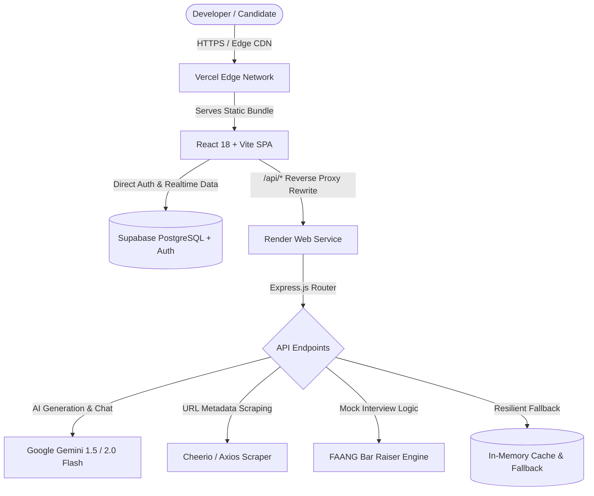

# ⚡ AlgoCraft — System Architecture & Complete Technical Specification

> **AI-Powered Data Structures & Algorithms Mentor, Interview Studio & Algorithm Visualizer**  
> *Engineered by **Shivansh Rai** (<shivanshrai282@gmail.com>)*

---

## 🌐 Live Production Deployments & Links

| Service | Destination / URL | Purpose |
| :--- | :--- | :--- |
| **Frontend Web App** | [https://algo-craft-dsa-mentor.vercel.app/](https://algo-craft-dsa-mentor.vercel.app/) | Global edge-deployed React application on Vercel |
| **Backend AI API** | [https://algocraft-dsamentor.onrender.com/](https://algocraft-dsamentor.onrender.com/) | High-performance Node.js / Express microservice on Render |
| **Database & Auth** | [Supabase PostgreSQL (`uizxmkjriccpicmyzjqh`)](https://supabase.com/) | Managed PostgreSQL with Row-Level Security (RLS) & Auth |
| **GitHub Repository** | [shivansh1824-dev/AlgoCraft-DSAmentor](https://github.com/shivansh1824-dev/AlgoCraft-DSAmentor) | Open-source monorepo containing client & server |

---

## 🎯 1. Executive Summary & Vision

**AlgoCraft** was conceived to eliminate the friction, paywalls, and cognitive overload associated with technical interview preparation. While platforms like LeetCode or HackerRank test coding syntax and NeetCode provides static guides, candidates frequently struggle to bridge the gap between *understanding the problem* and *deriving optimal solutions from scratch*.

AlgoCraft serves as an always-available, private, senior FAANG mentor that:
1. Deconstructs any algorithmic problem into **3 progressive pedagogical tiers** (Brute Force $\rightarrow$ Better $\rightarrow$ Optimal).
2. Provides **interactive real-time algorithmic visualizations** across classic data structures.
3. Automatically parses problem URLs from LeetCode, GeeksforGeeks, and Codeforces to populate custom playlists.
4. Uses **Spaced Repetition Flashcards** and **Browser Speech Synthesis** to cement algorithmic intuition into long-term memory.
5. Operates **100% free forever** with no subscription fees, credit limits, or credit card requirements.

---

## 🎨 2. Design System & Aesthetics

AlgoCraft adheres to an **OLED Dark Cyberpunk** design language designed to minimize eye fatigue during marathon coding sessions while delivering an ultra-premium developer tool aesthetic.

### Visual Foundations
- **Background Depth**: `#030712` (True Cyber Black) layered with `#0f172a` (Slate 900) card surfaces and glassmorphic translucent borders (`rgba(255, 255, 255, 0.08)`).
- **Primary Accents**:
  - **Neon Cyan / Sky** (`#06b6d4` / `#0ea5e9`): Represents analysis, code generation, and interactive exploration.
  - **Emerald Neon** (`#10b981`): Denotes optimal solutions, passing test cases, and mastery.
  - **Amber Flame** (`#f59e0b`): Highlights warnings, intermediate approaches, and revision flags.
  - **Rose / Crimson** (`#f43f5e`): Signals brute-force inefficiency and syntax/algorithmic errors.
  - **Electric Violet** (`#8b5cf6`): Reserved for AI mentorship, speech synthesis, and interview simulation.
- **Typography**:
  - **Display / UI**: `Inter`, system `-apple-system`, `BlinkMacSystemFont` for crisp hierarchy and legible density.
  - **Monospace / Code**: `Fira Code`, `JetBrains Mono` with font ligatures for mathematical operators and syntax tokens.
- **Micro-Interactions**:
  - CSS 3D transforms (`perspective: 1000px`, `rotateY(180deg)`) for flashcard flipping.
  - Custom SVG canvas renderers for mathematical tree node graphs.
  - Glowing border gradients and ambient blur backdrops (`backdrop-blur-md`).

---

## 💻 3. Complete Technology Stack



### Frontend Architecture (`/client`)
- **Core Framework**: React 18 with functional components and modern React Hooks.
- **Build Tool**: Vite 6 (Lightning-fast HMR, sub-second production builds).
- **Styling**: Tailwind CSS 4 with `@tailwindcss/vite` compiler plugin for zero-runtime CSS overhead.
- **Routing**: React Router DOM v6 with declarative SPA client-side route handling.
- **Icons**: Lucide React (featherweight SVG icons).
- **HTTP Client**: Axios with baseURL injection and proxy fallbacks.
- **Audio / Speech Engine**: Native Web Audio API for UI audio feedback + Web Speech API (`SpeechSynthesisUtterance`) for hands-free audio revision.

### Backend Microservice (`/server`)
- **Runtime**: Node.js (v20+ LTS).
- **Web Framework**: Express.js with JSON streaming and cookie parser.
- **Cross-Origin Security**: Dynamic multi-origin CORS whitelist supporting localhost, Vercel preview domains, and production origins.
- **Web Scraping**: Cheerio + native fetch for parsing OpenGraph metadata and HTML problem structures.
- **AI Integration**: Direct Google Gemini API communication via `v1beta` REST endpoints supporting `gemini-1.5-flash`, `gemini-2.0-flash`, and `gemini-2.5-flash`.
- **Fault-Tolerance**: Dual-tier fallback engine providing algorithmic templates if external AI rate limits occur.

### Database & Security Layer
- **Engine**: Supabase PostgreSQL 15.
- **Row-Level Security (RLS)**: Fine-grained access policies ensuring users can only mutate their own solutions, playlists, and flashcards.
- **Authentication**: Supabase Auth (Email & Password, GitHub OAuth, and guest Demo access).

---

## ⚙️ 4. Core Feature Specifications

### Feature 1: AI Multi-Testcase Generator & Stress-Testing Studio
- **Input**: Problem name or LeetCode URL, target programming language (C++, Java, Python, JavaScript), and current stuck point.
- **Multi-Approach Deconstruction**:
  1. **Brute Force**: Inefficient yet intuitive starting approach (e.g. $O(N^2)$ or $O(2^N)$).
  2. **Better**: Intermediate optimization using hash tables, sorting, or two-pointers.
  3. **Optimal**: Production-grade FAANG standard (e.g. $O(N)$ time with $O(1)$ space).
- **Mathematical Complexity Engine**: Formal proofs of Time Complexity ($T(n)$) and Auxiliary Space Complexity ($S(n)$).
- **Step-by-Step Dry-Run Trace**: Table recording variables, pointer states, and array snapshots per loop iteration.
- **Edge-Case Matrix**: Highlights empty arrays, single elements, duplicates, negative numbers, and integer overflow constraints.

### Feature 2: Interactive 6-Algorithm Visualizer Studio
Dedicated client-side interactive visual simulation studio containing 6 specialized render engines:
1. **Binary Tree Visualizer**: Recursive SVG canvas rendering with level-order coordinate calculations, parent-child connecting lines, and node insertion/traversal.
2. **Linked List Visualizer**: Singly linked list nodes with animated directional pointers, head/tail badges, and insert/delete step controls.
3. **Bubble Sort Visualizer**: Dynamic vertical bar array with color-coded comparison pointers (Active, Comparing, Swapping, Sorted).
4. **Floyd's Cycle Detection**: Circular linked list simulation demonstrating the mathematical meeting point of Slow ($1\times$) and Fast ($2\times$) runners.
5. **Stack & Queue Visualizer**: Visual demonstration of LIFO (Push/Pop) with container boundaries vs FIFO (Enqueue/Dequeue) with sliding arrays.
6. **Array Bar Chart**: Mathematical complexity curves plotting $O(1)$, $O(\log N)$, $O(N)$, $O(N \log N)$, and $O(N^2)$.

### Feature 3: Curated DSA Playlists with 1-Click URL Auto-Scraper
- Pre-loaded with standard interview preparation playlists:
  - **Blind 75** (Essential core patterns)
  - **NeetCode 150** (Comprehensive interview coverage)
  - **Striver SDE Sheet** (Top product-based company questions)
- **URL Auto-Parser**: Paste any URL from LeetCode, GeeksforGeeks, or Codeforces; the backend extracts:
  - Problem title and slug
  - Difficulty rating (Easy, Medium, Hard)
  - Canonical algorithm tags
  - Problem statement summary
- **Custom Playlists**: Full CRUD capability for custom company-specific sheets stored directly in PostgreSQL.

### Feature 4: Spaced Repetition Flashcards & Smart Audio Mode
- **Pedagogical Basis**: Implements SuperMemo SM-2 repetition principles to combat the Ebbinghaus forgetting curve.
- **3D Card Flip**: Interactive CSS 3D cards revealing the core "Aha!" moment on flip.
- **Recall Grading**: Easy (7-day interval), Medium (3-day interval), Hard (immediate review).
- **Smart Audio Mode**: Utilizes browser speech synthesis with customized voice parameters to narrate problem intuition and edge cases hands-free.

### Feature 5: AI Mock Interview Room with Bar Raiser Evaluator
- Simulates realistic 30-to-45-minute timed coding assessments for target companies (Google, Meta, Amazon, Microsoft).
- Provides starter function templates in C++, Python, and Java.
- **Bar Raiser Scoring Engine**: Evaluates code submissions against 5 criteria:
  1. Algorithmic Correctness
  2. Time/Space Efficiency
  3. Code Cleanliness & Production Readability
  4. Handling of Edge Cases
  5. Hiring Verdict (`Strong Hire`, `Hire`, `Lean Hire`, `No Hire`) with actionable candidate feedback.

### Feature 6: Conversational DSA Mentor Chatbot
- Embedded slide-out drawer available on every page.
- Context-aware dialogue capable of answering targeted questions such as *"Why does Kadane's algorithm reset the sum to 0?"* or *"How do I detect a negative cycle using Bellman-Ford?"*

---

## 🗄️ 5. PostgreSQL Database Schema

Applied directly to Supabase via `supabase_schema.sql`:

```sql
-- 1. Profiles Table (Linked to Supabase Auth)
create table public.profiles (
  id uuid references auth.users on delete cascade primary key,
  email text unique not null,
  name text,
  problems_solved int default 0,
  streak_days int default 0,
  target_role text default 'Software Engineer',
  preferred_language text default 'C++',
  created_at timestamp with time zone default timezone('utc'::text, now()) not null
);

-- 2. Solutions Table (Stores Generated Breakdowns)
create table public.solutions (
  id uuid default gen_random_uuid() primary key,
  user_id uuid references auth.users on delete cascade,
  problem_name text not null,
  platform text default 'LeetCode',
  topic text not null,
  difficulty text not null,
  language text not null,
  intuition text,
  approaches jsonb default '[]'::jsonb,
  dry_run jsonb default '{}'::jsonb,
  edge_cases jsonb default '[]'::jsonb,
  bookmarked boolean default false,
  notes text default '',
  created_at timestamp with time zone default timezone('utc'::text, now()) not null
);

-- 3. Saved Sheets Table (Playlists & Problem Checklists)
create table public.saved_sheets (
  id uuid default gen_random_uuid() primary key,
  user_id uuid references auth.users on delete cascade,
  title text not null,
  description text default '',
  category text default 'Custom',
  sections jsonb default '[]'::jsonb,
  is_public boolean default false,
  created_at timestamp with time zone default timezone('utc'::text, now()) not null
);

-- 4. Flashcard Progress Table (Spaced Repetition Tracking)
create table public.flashcard_progress (
  id uuid default gen_random_uuid() primary key,
  user_id uuid references auth.users on delete cascade,
  card_id text not null,
  status text check (status in ('unreviewed', 'hard', 'medium', 'easy')) default 'unreviewed',
  review_count int default 0,
  next_review_at timestamp with time zone default timezone('utc'::text, now()) not null,
  unique(user_id, card_id)
);
```

---

## 🔌 6. API Reference & Contract

| Method | Endpoint | Description | Request Body / Params |
| :--- | :--- | :--- | :--- |
| `GET` | `/api/health` | Service health & pricing guarantee | None |
| `POST` | `/api/generate` | Generate 3-approach solution breakdown | `{ name, platform, topic, difficulty, language, stuckPoint }` |
| `POST` | `/api/parse-url` | Scrape problem metadata from external site | `{ url }` |
| `POST` | `/api/chat` | AI Mentor conversation turn | `{ message, history }` |
| `GET` | `/api/roadmap` | Canonical hierarchical DSA topic trees | None |
| `POST` | `/api/interview/start` | Initialize mock interview session | `{ company, difficulty, duration }` |
| `POST` | `/api/interview/submit`| Submit code for AI Bar Raiser evaluation | `{ problemTitle, code, language, timeSpentSeconds, hintsUsed }` |
| `GET` | `/api/solutions` | Retrieve cached user solutions | `?topic=&difficulty=&search=` |
| `POST` | `/api/solutions/:id/bookmark` | Toggle solution bookmark status | None |
| `PUT` | `/api/solutions/:id/notes` | Save personal study notes | `{ notes }` |

---

## 🛡️ 7. Engineering Methodologies & Resilience

1. **Edge Proxy Routing (Zero CORS Friction)**:
   - Configured in `client/vercel.json`:
     ```json
     {
       "rewrites": [
         { "source": "/api/(.*)", "destination": "https://algocraft-dsamentor.onrender.com/api/$1" },
         { "source": "/(.*)", "destination": "/index.html" }
       ]
     }
     ```
   - Eliminates cross-origin browser blockers, masks backend infrastructure, and provides a unified single-domain interface.

2. **Dual-Tier Resilient AI Engine**:
   - The primary tier streams through Google Gemini AI (`v1beta`).
   - If an external rate limit occurs, the system switches to an algorithmic fallback engine (`fallbackEngine.js`) to ensure users never experience a broken UI.

3. **No-Paywall Architecture**:
   - Built entirely on generous, permanently free developer tiers (Vercel Edge, Render Free Web Services, Supabase Free Tier, Google AI Studio Free Tier).
   - Zero billing cards or hidden fees required to run, maintain, or fork.

---

## 🚀 8. Local Setup & Reproduction Guide

### Prerequisites
- Node.js (v18 or higher)
- Git

### Installation
```bash
# 1. Clone the repository
git clone https://github.com/shivansh1824-dev/AlgoCraft-DSAmentor.git
cd AlgoCraft-DSAmentor

# 2. Install backend dependencies
cd server
npm install
cp .env.example .env

# 3. Install frontend dependencies
cd ../client
npm install
cp .env.example .env
```

### Running Locally
```bash
# Terminal 1: Start Backend Server
cd server
node index.js
# Runs on http://localhost:5000

# Terminal 2: Start Frontend App
cd client
npm run dev
# Runs on http://localhost:5173
```

---

## 👨‍💻 9. Author & Ownership

- **Author**: **Shivansh Rai**
- **Email**: [shivanshrai282@gmail.com](mailto:shivanshrai282@gmail.com)
- **GitHub**: [@shivansh1824-dev](https://github.com/shivansh1824-dev)
- **Live Platform**: [algo-craft-dsa-mentor.vercel.app](https://algo-craft-dsa-mentor.vercel.app/)

*AlgoCraft is licensed under the MIT Open Source License.*
