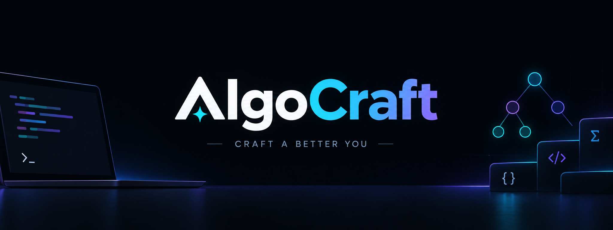

<p align="center">
  
</p>

<h1 align="center">⚡ AlgoCraft</h1>

<p align="center">
  <strong>AI-Powered DSA Mentor • Algorithm Visualizer • Interview Studio</strong>
</p>

<p align="center">
  <i>Learn • Visualize • Practice • Revise • Master</i>
</p>

<p align="center">
  <a href="https://algo-craft-dsa-mentor.vercel.app/">
    
  </a>
  <a href="https://github.com/shivansh1824-dev/AlgoCraft-DSAmentor">
    
  </a>
</p>

---

## 🧠 About AlgoCraft

**AlgoCraft** is an AI-powered learning platform built to make **Data Structures & Algorithms preparation more interactive, structured, and effective**.

Instead of simply giving a solution, AlgoCraft helps users understand the journey from:

> **Brute Force → Better → Optimal**

while combining AI mentorship, algorithm visualization, curated problem sheets, spaced repetition, and mock interviews in one platform.

---

## ✨ Features

### 🤖 AI DSA Mentor

Get guided explanations for coding problems with:

* 💡 Problem intuition
* 🔄 Brute Force → Better → Optimal approaches
* ⏱️ Time complexity analysis
* 💾 Space complexity analysis
* 🧪 Step-by-step dry runs
* ⚠️ Edge-case identification
* 💻 C++, Java, Python & JavaScript support

---

### 📊 Interactive Algorithm Visualizer

Understand algorithms by **seeing them in action**.

| 🔢 Visualizer        | 📌 Concept                    |
| -------------------- | ----------------------------- |
| 🌳 Binary Tree       | Tree construction & traversal |
| 🔗 Linked List       | Nodes, pointers & operations  |
| 🫧 Bubble Sort       | Comparisons & swaps           |
| 🔄 Floyd's Algorithm | Cycle detection               |
| 📚 Stack & Queue     | LIFO & FIFO operations        |
| 📈 Complexity        | Algorithm growth comparison   |

---

### 📚 DSA Problem Playlists

Prepare using popular interview sheets:

* 🎯 **Blind 75**
* 🧩 **NeetCode 150**
* 🔥 **Striver SDE Sheet**
* 📝 Custom problem playlists

You can also import problems using URLs from:

**LeetCode • GeeksforGeeks • Codeforces**

---

### 🧠 Spaced Repetition Flashcards

Turn solved problems into long-term knowledge.

* 🃏 Interactive 3D flashcards
* 🔁 Spaced repetition
* 🧠 Recall-based difficulty grading
* 🔊 Browser-based audio revision
* 📅 Smart review scheduling

---

### 🎯 AI Mock Interviews

Practice coding interviews in a realistic environment.

* ⏱️ Timed interview sessions
* 🏢 Company-focused preparation
* 💻 C++, Java & Python
* 🧪 Code evaluation
* 📊 Complexity analysis
* 📝 Detailed interview feedback
* 🏆 Hiring-style verdicts

---

### 💬 Conversational DSA Mentor

Have a conversation with your personal DSA mentor and ask questions such as:

> *"Why does Kadane's algorithm reset the sum to 0?"*

> *"How can I detect a negative cycle using Bellman-Ford?"*

Get explanations focused on **understanding the concept rather than memorizing the code**.

---

## 🛠️ Tech Stack

### 🎨 Frontend

<p>
  
  
  
  
  
</p>

### ⚙️ Backend

<p>
  
  
  
</p>

### 🧠 AI & Data

<p>
  
  
  
</p>

### ☁️ Deployment

<p>
  
  
</p>

---

## 🏗️ Project Structure

```text
AlgoCraft-DSAmentor/
│
├── 📁 client/
│   ├── 📁 public/
│   │   └── 📁 images/
│   │       └── 🖼️ a_clean_modern_minimal_dark_themed_hero_banner.png
│   └── 📁 src/
│
├── 📁 server/
│   ├── 📄 index.js
│   └── 📦 package.json
│
├── 📄 supabase_schema.sql
└── 📄 README.md
```

---

## 🚀 Getting Started

### 📋 Prerequisites

Make sure you have installed:

* 🟢 Node.js 18+
* 🔧 Git

### 1️⃣ Clone the Repository

```bash
git clone https://github.com/shivansh1824-dev/AlgoCraft-DSAmentor.git
cd AlgoCraft-DSAmentor
```

### 2️⃣ Setup the Backend

```bash
cd server
npm install
cp .env.example .env
node index.js
```

The backend will run on:

```text
http://localhost:5000
```

### 3️⃣ Setup the Frontend

Open a new terminal:

```bash
cd client
npm install
cp .env.example .env
npm run dev
```

The frontend will run on:

```text
http://localhost:5173
```

---

## 🔄 How AlgoCraft Works

```text
             🧑‍💻 Problem
                  │
                  ▼
          🤖 AI DSA Mentor
                  │
       ┌──────────┼──────────┐
       ▼          ▼          ▼
   🔴 Brute    🟡 Better   🟢 Optimal
       │          │          │
       └──────────┼──────────┘
                  ▼
           📊 Visualize
                  │
                  ▼
          🧪 Practice & Solve
                  │
                  ▼
          🧠 Revise & Recall
                  │
                  ▼
           🎯 Mock Interview
```

---

## 🎯 Vision

AlgoCraft brings the complete DSA preparation cycle into one place:

**🧠 Learn → 👀 Visualize → 💻 Practice → 🔁 Revise → 🎯 Interview**

The goal is simple:

> **Build better problem solvers, not just better code writers.**

---

## 🌐 Links

🚀 **Live Application**
https://algo-craft-dsa-mentor.vercel.app/

💻 **GitHub Repository**
https://github.com/shivansh1824-dev/AlgoCraft-DSAmentor

---

## 👨‍💻 Author

**Shivansh Rai**

🐙 GitHub: https://github.com/shivansh1824-dev

---

## 📄 License

This project is licensed under the **MIT License**.

---

<p align="center">
  <strong>⚡ AlgoCraft — Craft a Better You.</strong>
</p>

<p align="center">
  <i>Built for developers who want to understand algorithms, not just solve them.</i>
</p>
